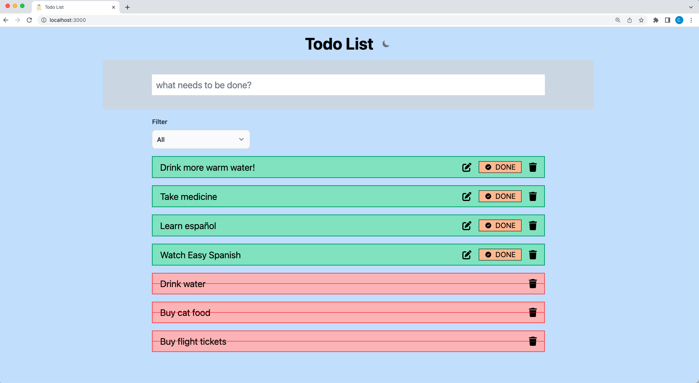

# Todo List using Svelte

## Getting Started

```sh
# docker

# use docker-compose
docker-compose up
```

Open [http://localhost:](http://localhost:3000) with your browser to see the result.

## Todo List Page


